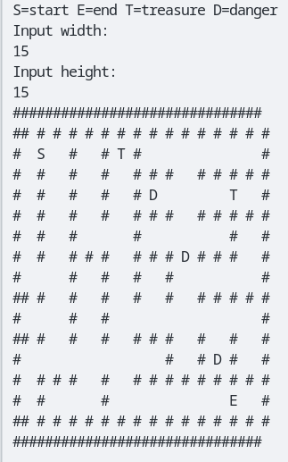
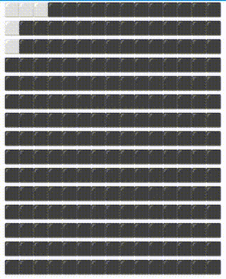
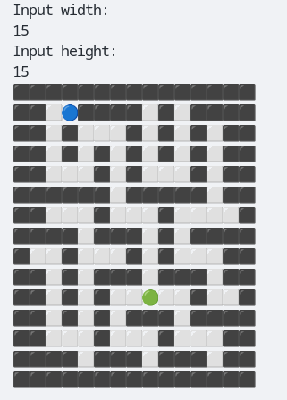
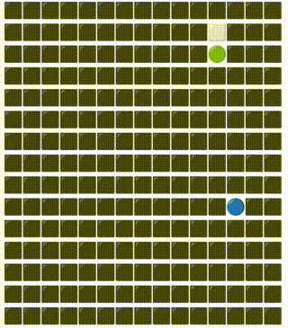

# Maze Generators

I have implemented 2 ways of generating maze

## Preview

### Prims Demo

### Recursive Demo

## Running

You can run both Recursive and Prim's algorithms.

For running Prims algorithm:

- Linux/Mac:

  go run Prims/[Filename].go

- Windows:

  go run Prims\\[Filename].go

For running Recursive:

- Linux/Mac:

  go run Recursive/[Filename].go

- Windows:

  go run Recursive\\[Filename].go

## Efficiency & Complexity

**Prim's Algorithm:**

- Efficiency: Prim's algorithm is efficient in generating mazes with a uniform distribution of passages. It tends to produce mazes with longer passages and fewer dead ends.
- Complexity: The time complexity of Prim's algorithm for maze generation is O(N^2), where N is the number of cells in the maze. This complexity arises from the need to maintain a list of frontier cells and update the connectivity of the maze.

**Recursive Backtracking:**

- Efficiency: Recursive backtracking is simple and easy to implement. It tends to produce mazes with shorter, more winding passages and more dead ends compared to Prim's algorithm.
- Complexity: The time complexity of recursive backtracking for maze generation is O(N), where N is the number of cells in the maze. This is because each cell is visited exactly once during the generation process.

## Example Input

Input width:

25

Input height:

25

## Time

~8 hours spent on this project
